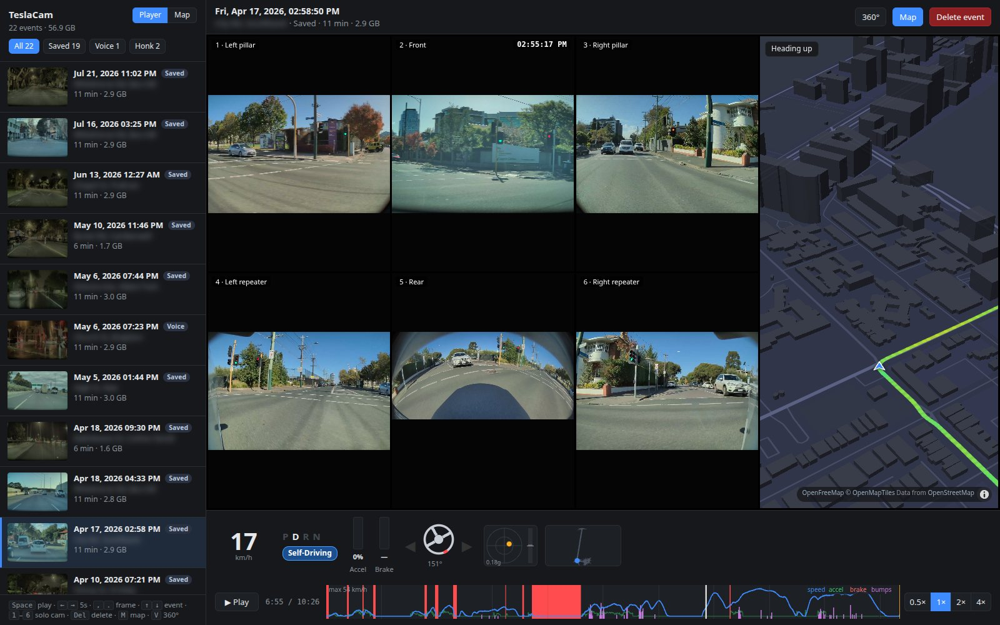
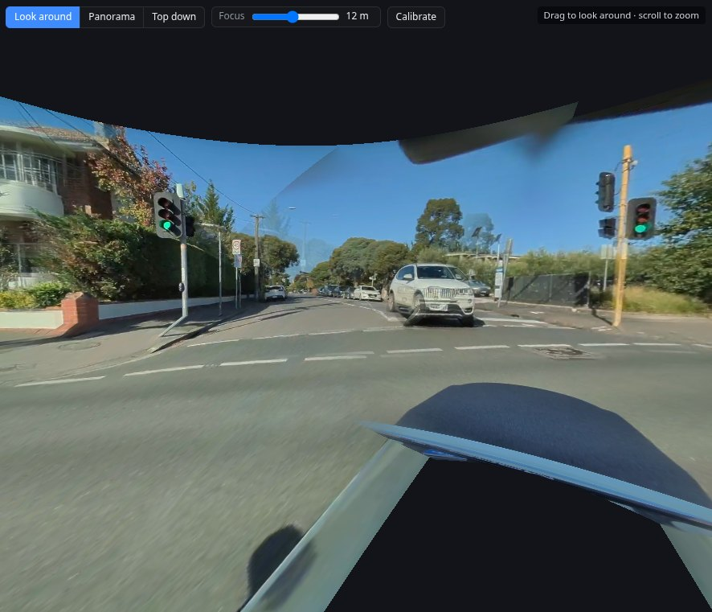
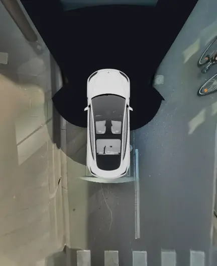
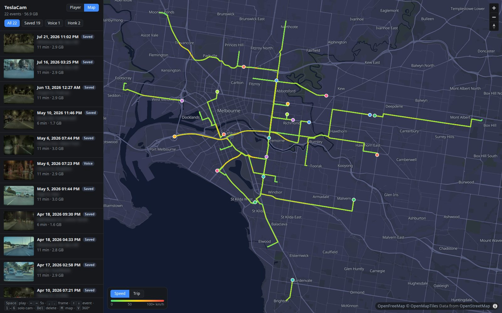

# Glovebox

Watch your Tesla's dashcam and Sentry recordings on your computer, straight from
the car's USB drive.



What you get:

- all six cameras playing together, in sync;
- speed, pedals, steering, indicators and Autopilot from the car's own data;
- a map of where each recording happened, and a small map that follows along;
- a 360° view that stitches the cameras into one picture around the car, including
  a view from straight above with the front wheels turning as you steered;
- deleting recordings you don't want to keep.

<p align="center">
  
  
</p>
<p align="center"><em>Left: look around in 360°. Right: the view from above, front wheels steering as the car did.</em></p>

Everything runs on your own computer. Your recordings are never uploaded.

## Get it

1. On this page, click the green **Code** button, then **Download ZIP**.
2. Unzip it: double-click the downloaded file. Put the folder somewhere you'll find
   it again, for example in Documents.

## Start it

Plug the USB drive from your car into your computer. Then open the folder and
double-click the start file for your computer:

| Computer | File to double-click |
|---|---|
| Windows | **Start on Windows.bat** |
| Mac | **Start on Mac.command** |
| Linux | **Start on Linux.sh** |

A black window opens and your web browser shows the viewer. Keep the black window
open while you use the viewer, and close it when you're done.

The first start takes a couple of minutes, because it downloads what the viewer
needs. After that it starts in seconds.

**If your computer won't open the file:**

- **Windows** may say "Windows protected your PC". Click **More info**, then
  **Run anyway**.
- **Mac** may say the file "can't be opened because it is from an unidentified
  developer". Right-click (or Control-click) the file, choose **Open**, then
  **Open** again. You only need to do this once.
- **Linux**: right-click the file and choose **Run as a Program**. If there's no
  such option, open a terminal in the folder and type `./"Start on Linux.sh"`.

If you've copied the TeslaCam folder to your computer instead of using the USB
drive, put it in your home folder, Desktop or Downloads, and the viewer will find
it there. On Windows you can also drag the TeslaCam folder onto the start file.

## Use it

Click a recording on the left to play it.

| Key | Does |
|---|---|
| Space | Play / pause |
| ← → | Back / forward 5 seconds |
| , . | Back / forward one frame |
| ↑ ↓ | Previous / next recording |
| 1–6 | Show one camera large |
| V | 360° view |
| M | Show or hide the follow map |
| Delete | Delete the recording from the USB drive (asks first) |

The **Map** button at the top of the list shows all your recordings on a map,
coloured by speed:



<sub>In these screenshots place names, street names and the GPS position are blurred or hidden, and the map shows made-up drives.</sub>

## Fit the 360° view to your car

The 360° view needs to know exactly where each camera on your car points. It comes
set up for a 2026 Model 3. Cameras sit a little differently on every car, and other
models put them elsewhere, so you can fit it to yours in one click:

1. Make sure the USB drive has a few recordings of daytime driving. Saved clips
   (tap the dashcam icon while driving) and Sentry clips both work. Drives through
   town with some turns are best.
2. Play any recording, press **360°**, then **Calibrate**.
3. Pick your car and click **Calibrate from my drives**.

It takes about five minutes, and you can keep watching while it works. When it's
done, the 360° view switches to your car's calibration. If you liked the old one
better, click **Undo last change**.

If you drive a 2026 Model 3, the built-in calibration was carefully measured on
one and will probably fit your car better than this quick one. Try it first.

The **Focus** slider picks the distance at which the cameras line up best. The
cameras sit up to 3.4 m apart on the car, so things can only line up perfectly at
one distance at a time.

## Good to know

- **Maps** need an internet connection. They come from OpenFreeMap; only the map
  area being shown is requested, never your recordings.
- **Encrypted recordings.** Newer Tesla software can encrypt dashcam recordings
  (they appear in an `EncryptedClips` folder). The viewer can't play those. Turn
  off encryption in the car's dashcam settings to record viewable clips.
- **Telemetry** (speed, steering and so on) is only in recordings made by recent
  Tesla software. Older clips play without it.
- **Deleting** a recording removes it from the USB drive for good.

## For developers

The viewer is a small Python web server (`server.py`, standard library only) and a
plain JavaScript page in `static/`. Run it with `python3 server.py`, optionally
passing the TeslaCam folder. `telemetry.py` reads the data Tesla embeds in each
clip.

| Where | What |
|---|---|
| `server.py`, `telemetry.py` | the local server and the clip telemetry reader |
| `static/` | the page: player, maps, 360° view (`static/js/pano.js`) |
| `static/cars/` | pictures of each car from above, for the Top down view |
| `tools/calibration/` | the camera calibration behind **Calibrate from my drives** |
| `requirements.txt` | numpy, scipy and OpenCV, needed only for calibration |
| `docs/` | the screenshots in this README |

The 360° view needs to know where each camera sits on the car, which way it points
and how its lens bends the picture. The built-in values in `static/js/pano.js` were
measured on one 2026 Model 3 (HW4). The calibration scripts solve them again from a
car's own drives; the Calibrate button runs all three steps below.

### Calibrating by hand

You need a TeslaCam drive with some daytime driving (a few saved drives through
town work well, because turns help) and `pip install -r requirements.txt`.

```sh
cd tools/calibration
python3 extract.py            # ~30 s: picks ~80 moments and saves their frames to work/
python3 match.py              # ~1 min: finds the same scenery across frames (uses all CPU cores)
python3 solve.py              # ~2 min: solves all cameras, writes ../../calibration.json
```

`solve.py` assumes a Model 3 Highland (HW4). For another car, pass its vehicle
file, e.g. `python3 solve.py --vehicle model_y_juniper_hw4` (see
[Vehicles](#vehicles)).

`extract.py` finds the TeslaCam folder on a plugged-in drive automatically; pass
the path if it doesn't. Reload the viewer and the 360° view uses
`calibration.json`. Delete that file to go back to the built-in values. Any
slider tweaks in the Calibrate panel are saved in your browser on top of the
file, and they're dropped whenever the file changes.

At the end, `solve.py` prints a median reprojection error. Around 1.5–2 px is a
good result. If it's much higher, or a camera's field of view looks odd, there
probably wasn't enough daytime driving. Try `extract.py --hours 7-19` or
`--seed 2` for a different sample.

### How calibration works

1. **extract.py** reads the telemetry Tesla embeds in each clip (speed, heading,
   gear) and picks moments while driving. Each moment is two instants a
   fraction of a second apart, some on straight road and some mid-turn. It
   saves every recorded camera's frames at both instants, plus how far the car
   moved and turned in between. It works out which cameras the car records
   from the clips, since HW3 cars may record fewer than HW4.

   The six files of a minute end at the same instant, but each camera starts
   recording at its own keyframe, up to half a second apart. So each camera's
   frame is taken at the front camera's file time plus the difference in file
   durations, which puts every camera at the same real instant.
2. **match.py** finds the same scenery points (SIFT features, checked with
   RANSAC):
   - within each camera across the two instants;
   - between neighbouring cameras at the same instant.
3. **solve.py** runs a bundle adjustment. It adjusts every camera's yaw, pitch,
   roll and lens curve, plus a depth for every matched point, until each point
   lands where it was seen. The car's own motion is taken from the telemetry.
   It first fits each camera on its own from 15 starting angles around the
   vehicle file's rough aim, so that aim only needs to be within about 20°.
   Then it solves all the cameras together. Two constraints keep the solve
   stable:
   - Left and right cameras of the same kind share one lens, since they're the
     same part.
   - Camera positions are fixed. The footage alone can't pin them down, so they
     come from a 3D model.

### Vehicles

Each car is a file in `tools/calibration/vehicles/`:

| File | Car |
|---|---|
| `model_3_highland_hw4` | Model 3 Highland (HW4), the default |
| `model_3_hw3` | Model 3 (HW3) |
| `model_y_juniper_hw4` | Model Y Juniper (HW4) |
| `model_y_juniper_standard_hw4` | Model Y Juniper Standard (HW4) |
| `model_y_l_hw4` | Model Y L, the six-seater (HW4) |
| `model_y_hw3` | Model Y (HW3) |
| `model_s_2021_hw4` | Model S 2021+, including Plaid (HW4) |
| `model_x_2021_hw4` | Model X 2021+ (HW4) |
| `cybertruck_hw4` | Cybertruck (HW4) |

The cameras were placed by hand on 3D models of each car. Only the Model 3
Highland has been checked against real footage so far.

```json
{
 "name": "Model 3 Highland (HW4)",
 "eye": [0, 1.247, 1.294],
 "cameras": {
  "front": {"pos": [0.0, 1.287, 1.844], "aim": [0, -5]},
  "back":  {"pos": [-0.0485, 0.847, -0.901], "aim": [180, -18.4]},
  ...
 }
}
```

- **`pos`** is where each lens sits, in metres from the ground under the rear
  axle (x right, y up, z forward). Get these as accurately as you can: the
  solve keeps them fixed. On the Model 3, the rear camera really is about 5 cm
  left of centre.
- **`aim`** is a rough [yaw, pitch] in degrees (yaw + = right, pitch + = up).
  The solve finds the exact angles.
- **`eye`** is where the 360° view looks out from: roughly the middle of the
  cabin at head height.
- **`mask`** (optional) limits which part of a camera's picture the 360° view
  uses: a circle in the middle (radius in image widths) and a widest angle from
  the lens axis. It keeps out parts of the car that the camera sees around the
  edges of its frame. Without one, the rear camera gets
  `{"circle": 0.49, "maxAngle": 72}`, which trims the Model 3 Highland's trunk
  lip and plate bracket. `"mask": null` turns it off.
- **`lens`** (optional) is a starting [f, k1, k2] if a camera differs a lot from
  a Model 3's.

#### Making them from a Blender model

`blender_cameras.py` reads camera positions and aims from a .blend. The .blend is
only read, never saved.
1. Each camera is a mesh with a single edge. Put the first vertex on the lens
   and the second along the direction the camera looks. Name them `Front_cam`,
   `L_pillar_cam`, `L_repeater_cam` and `Rear_cam`. You can add `R_…` versions
   too; if you don't, the right side is mirrored from the left.
2. For several cars in one file, give each car its own collection, named after
   the car. In each collection, put an empty called `Rear_axle` on the ground
   under the centre of the rear axle, with its y axis pointing forward. Then:

   ```sh
   blender -b cars.blend --python blender_cameras.py -- vehicles/
   ```

   This writes one vehicle file per collection.
3. For a single car without a `Rear_axle` empty, pass the axle position instead:

   ```sh
   blender -b car.blend --python blender_cameras.py -- vehicles/model_y.json "Model Y (HW4)" \
       --rear-axle-y -1.373 --ground-z 0
   ```

   - `--rear-axle-y` is the rear axle's Blender Y coordinate. Blender's axes are
     x right, y forward, z up.
   - `--ground-z` is where the tyres touch the ground.

   The script writes a rough `eye` just behind the front camera; check it and
   adjust if needed.

### Limits

- **The pillar cameras are the least certain.** Each one shares scenery with
  only one other camera, so the solve can trade a little of its aim against its
  lens. On the car the built-in values were measured on, a solve from drives
  alone lands within about 5° of the careful measurement. That car's built-in
  values are better than what a solve gives, so Model 3 owners should try them
  first.
- **On the Model 3, the front camera and the pillar cameras don't overlap.**
  There is a real blind spot between them, so that seam can't be checked
  against footage.
- **Nothing lines up at every distance.** The cameras sit up to 3.4 m apart, so
  objects can only line up at one distance at a time. The Focus slider in the
  360° view picks that distance.

## License

MIT, see [LICENSE](LICENSE).
